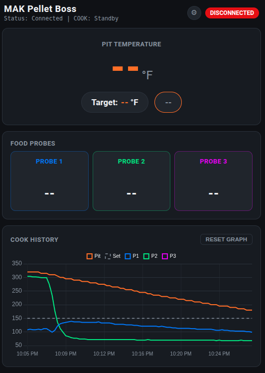
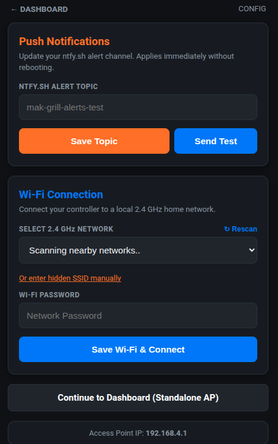

# MAK Pellet Boss

I had already created a project to manage my own grill [(mak-controller)](https://github.com/bawilson2/mak-controller/blob/main/README.md) but that required some technical background and home equipment that not everybody has.  I created this project to be something that ANYBODY can use for a super minimal cost. 

An ESP32-based local Wi-Fi controller and web dashboard for MAK Grills. 

This project intercepts telemetry from the grill's legacy Microchip RN-series Wi-Fi module, allowing you to monitor and control your grill entirely locally without relying on external cloud services. It provides a mobile-optimized, responsive UI with real-time graphing, customizable probe alarms, and push notifications.

  

## Features

* **Local Control:** Uses DNS spoofing to intercept `makgrillsmobile.com` traffic, keeping all grill communication on your local network.
* **Real-Time Dashboard:** Monitor pit temperature, active setpoints, and up to three food probes simultaneously.
* **Cook History Graph:** Automatically tracks and charts temperatures once the grill reaches its 150°F ignition threshold.
* **Smart Probe Alarms:** Set target temperatures for individual meat probes. Includes a tap-to-dismiss UI and smart visibility (hides unplugged probes).
* **Push Notifications:** Native integration with [ntfy.sh](https://ntfy.sh/) for instant mobile alerts when a probe hits its target.
* **Safety Interlocks:** Hardware-enforced safety logic prevents remote ignition. The app only allows remote shutdown and securely locks the UI during the grill's physical cooldown cycle.

## Hardware Requirements

* **ESP32 Development Board**
  * *Highly Recommended:*  [Seeed Studio XIAO ESP32S3] (https://www.amazon.com/dp/B0BYSB66S5)
  * Choose a board that includes an external Wi-Fi antenna (such as the Seeed Studio XIAO ESP32-S3). Because this controller acts as a wireless bridge between your indoor router and your outdoor grill, an external antenna significantly improves range and connection stability compared to boards with only a built-in PCB antenna.
* MAK Grill equipped with a Microchip RN-series Wi-Fi module
* 5V USB power supply (e.g., a standard phone charger)

### Recommended Enclosure
If you are using the Seeed Studio XIAO ESP32-S3 board for this project, a compatible 3D-printable case design is available here: 
* [XIAO ESP32-S3 Antenna Case with Buttons](https://www.printables.com/model/1616249-xiao-esp32-s3-antenna-case-with-buttons)

## How It Works

The legacy MAK Wi-Fi module is hardcoded to POST telemetry data to a specific domain (`makgrillsmobile.com`) every 10 seconds. 

1. **The Intercept:** The ESP32 broadcasts a SoftAP and runs a local DNS server. When the grill connects, the ESP32 resolves the hardcoded domain to its own local IP address.
2. **The Server:** A synchronous standard `WebServer` runs on Port 80 to receive the HTTP POST payloads. It parses the raw TCP telemetry (Temp, Power, Probes) while gracefully dropping the legacy module's malformed trailing newline characters to prevent keep-alive crashes.
3. **The Command:** The ESP32 replies to the POST request with a formatted string (`setPoint=X&power=X`) to update the grill's current state.

## Installation

You can install the firmware using a web-based flasher (no software required) or build it manually from the source code.

### Option 1: Web Flasher (Recommended)
1. Download the latest `firmware.bin` file from the **Releases** page of this repository.
2. Plug your ESP32 board into your computer using a data-capable USB cable.
3. Open [ESPTool Web](https://esptool.spacehuhn.com/) using a Web Serial-compatible browser (like Google Chrome or Edge).
4. Click **Connect** and select the COM/Serial port corresponding to your ESP32.
5. Set the flash address to `0x10000`
6. Select the `firmware.bin` file you downloaded and click **Program**.
7. Once flashing is complete, disconnect the USB cable to power off the ESP32, then plug it back in to boot the controller.

### Option 2: Build from Source
1. Clone this repository and open the project in your preferred IDE (PlatformIO or Arduino IDE).
2. Install the necessary library dependencies:
   * `bblanchon/ArduinoJson`
3. Compile and flash the code to your ESP32.

## Power and Placement

* 5V USB power supply (e.g., a standard USB C phone charger)
Because the ESP32 acts as a wireless bridge between the grill and your home network, physical placement matters. Power the ESP32 with a standard USB wall charger and place it physically between your home Wi-Fi router and the grill to ensure both the STA (home network) and SoftAP (grill) wireless connections remain stable. I was able to connect to my grill from about 75 feet away through multiple walls so the range on the ESP32 antenna was pretty good. 

## Initial Setup

1. Power on the ESP32.
2. Connect your phone or computer to the **MAK** Wi-Fi Access Point broadcast by the ESP32.
3. Navigate to `http://192.168.4.1` in your browser.
4. Click the **Settings** gear icon in the top right.
5. Enter your home 2.4 GHz Wi-Fi credentials and your preferred `ntfy.sh` alert topic.
6. Click **Save Wi-Fi & Connect**. The ESP32 will reboot and join your home network.
7. Connect your MAK Grill to the ESP32's SoftAP. The grill will begin transmitting telemetry to the controller automatically.

  

## Grill Wi-Fi Provisioning

To route your grill's data to the local dashboard, you must configure the grill to connect to the ESP32 instead of your home router. 

1. Change the SSID and password on your grill to the following:
   * **SSID:** `MAK` 
   * **Password:** `ABCDEFGH`

*Note: The access point password is intentionally hardcoded to ensure the physical grill can always seamlessly reconnect to the ESP32 without requiring hardware re-provisioning if the ESP32 ever loses its configuration.*

## Accessing the Dashboard

Once the ESP32 is successfully connected to your home network, you no longer need to use the `192.168.4.1` IP address. 

1. Ensure your phone or computer is connected to your regular home Wi-Fi network.
2. Open your browser and navigate to `http://makgrill.local`.
3. Power on your MAK Grill. It will begin transmitting telemetry to the controller automatically, and your dashboard will update to "ONLINE".

*Note: mDNS (`.local` addresses) is supported natively by iOS, macOS, Windows, and most modern Linux distributions. Some Android devices do not support mDNS natively; in that case, you can check your home router's DHCP client list to find the ESP32's assigned IP address and type that directly into your browser.*

## Setting up Push Notifications

1. Download the free **ntfy** app on iOS or Android. 
2. Tap the **+** icon to subscribe to a new topic.
3. Enter the exact same topic string you saved in the ESP32 config page (e.g., `my-custom-grill-alerts`). 

No account creation or registration is required. When a probe reaches its target temperature, the ESP32 will send an alert directly to this channel.

## Disclaimer and Safety Warning

**This is an unofficial, community-created project and is not affiliated with, endorsed by, or supported by MAK Grills.**

This software and hardware guide is provided "as is," without warranty of any kind. Modifying or controlling a wood pellet grill involves managing live fire. By building and using this project, you acknowledge and agree that:

* You are assuming all risks associated with interfacing custom hardware with a live-fire appliance.
* You should **never** leave a running grill unattended, regardless of remote monitoring or alarm capabilities. 
* The creator(s) and contributor(s) of this repository are not liable for any property damage, ruined food, personal injury, or catastrophic hardware failure resulting from the use of this code or hardware configuration.

Always prioritize physical safety and follow the manufacturer's original safety and operating guidelines for your grill.

## Support

If this project saved you some headaches or kept your grill running, you can help me buy another bag of pellets here:

